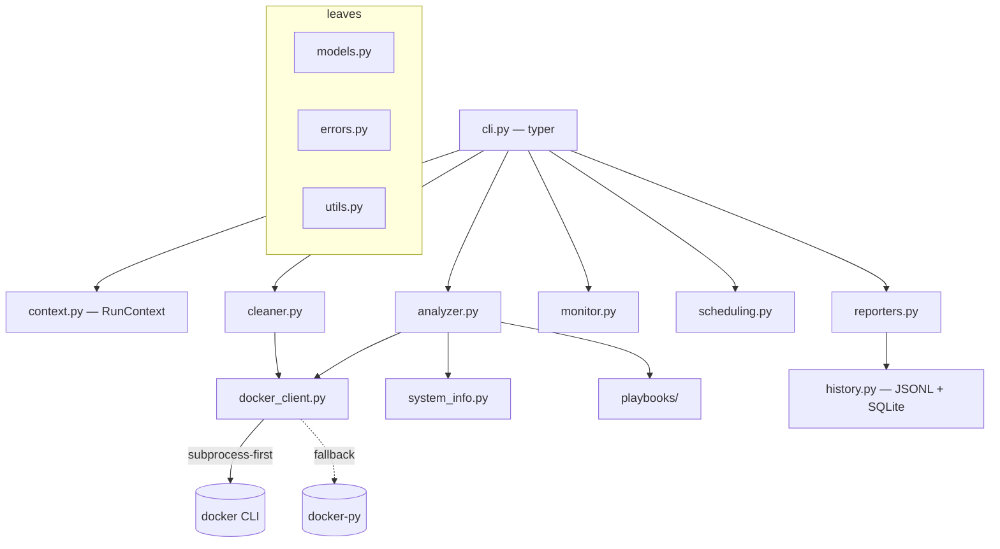

# Docker Disk Space Analyzer & Recovery Toolkit

`docker-disk` (aka `ddt`) — a production-grade CLI that ends the recurring
"we ran out of disk with Docker **again**" firefight. It runs the full loop:

> **diagnose → free space safely → prevent recurrence → leave an audit trail**

Works with Docker Engine and Docker Desktop across Linux, WSL2, macOS, and
Windows, in both root and rootless modes. Safety-first by design: **dry-run is
the default for every destructive action**, a protect-list guards your
databases, and every deletion is audited.

---

## Quick start

```bash
# Install (choose one)
uv tool install .          # from a checkout
pipx install .
# or for development:
uv pip install -e ".[dev]"

# Instant diagnosis (host + Docker disk usage, findings, recommendations)
docker-disk analyze

# Machine-readable
docker-disk analyze --json | jq

# Preview a safe cleanup — nothing is removed
docker-disk cleanup --dry-run --level 1

# Aggressive but protected cleanup (databases/Nextcloud/TrueNAS spared)
docker-disk cleanup --level 2 --protect 'postgres|nextcloud|truenas' --yes --no-dry-run

# Free space NOW (safest high-impact first), then next-step guidance
docker-disk emergency --no-dry-run

# Install a weekly safe prune + write metrics for monitoring
docker-disk install-cron --action cleanup --level 1 --schedule weekly --emit all
```

No Docker installed? `docker-disk analyze` still reports host disks and exits
cleanly with a clear remediation message — graceful degradation is a
first-class, tested path.

---

## Safety philosophy

1. **Dry-run is the default.** Every destructive command previews first. You
   opt into action with `--no-dry-run` (and `--yes` to skip the prompt).
2. **The protect-list always wins.** A built-in list guards stateful volumes
   (`postgres`, `mysql`, `mongo`, `redis`, `nextcloud`, `grafana`, `prometheus`,
   `vault`, `elastic`, `minio`, `truenas`, …). Add your own with `--protect`;
   protected objects are *never* removed, even at the nuclear level.
3. **Item-by-item, audited execution.** Each object is removed individually and
   recorded in `audit.jsonl`; one failure is logged and the run continues.
4. **Non-interactive shells refuse** to run a destructive action without
   `--yes` — so a misconfigured cron never nukes anything silently.
5. **Nuclear (level 3) needs an explicit `--force`** *and* a typed confirmation,
   even when `--yes` is set.
6. **Graceful degradation, never a crash.** Missing daemon, permission denied,
   Docker Desktop still starting — all produce structured, actionable errors.

---

## Commands & exit codes

| Command | What it does |
| --- | --- |
| `analyze` (default) | Deep diagnostic: host df + inodes, `docker system df`, top consumers, dangling/unused objects, correlation (in-use?), findings, recommendations. `--forensic` adds "what just ate my disk?". |
| `cleanup` | Multi-level prune (0 report · 1 safe · 2 aggressive-protected · 3 nuclear) with selective filters and before/after delta. |
| `emergency` | Free space now: safest high-impact prune first, then higher-impact next steps. |
| `monitor` | Evaluate thresholds, write `metrics.json` (+ optional Prometheus textfile), notify on breach. |
| `install-cron` | Generate systemd timer/service, crontab, and Windows Task Scheduler XML. |
| `report` | Historical trends (`--last 30d`), list stored reports (`--list`), render recovery playbooks (`--playbooks`), rebuild the index (`--rebuild-index`). |

**Exit codes:** `0` healthy/success · `1` warning (issues found, or low space but
cleaned) · `2` critical (still breached after actions) · `3` fatal (tool/config/
docker error).

---

## Common recipes

**Docker Desktop on Windows keeps eating my C: drive.**
The WSL2 VHDX grows but never shrinks. `docker-disk analyze` detects the backend,
flags the caveat (host free space ≠ Docker's space), and — when the VHDX is
bloated — generates a compaction script:

```powershell
docker-disk report --playbooks    # emits recover_vhdx_bloat.ps1
# then, reviewed and as Administrator:
wsl --shutdown
Optimize-VHD -Path "…\ext4.vhdx" -Mode Full   # or diskpart on Windows Home
```

**BuildKit cache exploded.**

```bash
docker-disk cleanup --level 1          # includes build cache
docker builder prune --filter until=168h -f   # or from the generated playbook
```

**AI/ML image bloat (Ollama, CUDA, big bases).**
`analyze` flags large AI/ML images; `report --playbooks` lists safe removals
(running models excluded) plus `ollama rm` hints.

**"Out of space again" — one shot.**

```bash
docker-disk emergency --no-dry-run     # safe tier, then guidance
docker-disk install-cron --action cleanup --level 1 --schedule weekly   # prevent recurrence
```

---

## Architecture



- **`docker_client.py`** talks to Docker via the `docker` CLI (subprocess,
  `--format '{{json .}}'`), falling back to docker-py, or a `NullDockerClient`
  when nothing is reachable. The subprocess seam is injected, so the whole test
  suite runs without a daemon.
- **`analyzer.py`** assembles the snapshot, correlates in-use objects, runs the
  recovery-playbook detectors, and grades health.
- **`cleaner.py`** builds a reviewable plan per level, enforces the protect-list,
  executes item-by-item, and records every action.
- **`reporters.py` / `history.py`** write timestamped Markdown+JSON reports, an
  append-only `audit.jsonl`, and a rebuildable SQLite trend index.

---

## Configuration

Resolved with precedence **CLI flag > env `DOCKER_DISK_*` > YAML > defaults**.
The YAML file is looked up at `--config PATH`, `$DOCKER_DISK_CONFIG`,
`~/.config/docker-disk-toolkit/config.yaml`, then the platform config dir.

```yaml
# ~/.config/docker-disk-toolkit/config.yaml
thresholds:
  critical_free_gb: 5      # <= min_free_gb <= warn_free_gb
  min_free_gb: 10
  warn_free_gb: 20
  min_free_percent: 10
  max_docker_percent: 70   # Docker usage as % of its host disk
protect_volumes: ["my_app_data"]        # globs / exact
protect_volumes_regex: ["^backup_"]     # regex
use_default_protect: true               # built-in DB/Nextcloud/etc. guards
prune_level: safe
report_dir: ~/docker-disk-reports
dry_run: true                           # safe default
notifications:
  enabled: false
  on_events: [critical]
  desktop: true
```

Env example: `DOCKER_DISK_THRESHOLDS__MIN_FREE_GB=15`.

| Flag | Meaning |
| --- | --- |
| `--dry-run/--no-dry-run` | Preview vs act (default: dry-run) |
| `--yes` / `-y` | Skip confirmation prompts |
| `--protect REGEX` | Extra protected volume pattern(s) |
| `--min-free-gb N` / `--max-docker-percent N` | Threshold overrides |
| `--report-dir PATH` | Where reports/audit/history live |
| `--json` | Machine-readable output |

---

## Reporting & audit

Every run writes `~/docker-disk-reports/<timestamp>_<cmd>_<id>.{json,md}`.
Cleanups append to `audit.jsonl` (what/size/command/confirmation/outcome) and a
`history.jsonl` summary, indexed into `history.db` (SQLite, rebuildable) for
trends: `docker-disk report --last 30d`.

---

## Development

```bash
make install     # editable install with dev extras
make test        # pytest
make cov         # pytest with the >=80% coverage gate
make lint        # ruff + black --check
make typecheck   # mypy strict
make all         # lint + typecheck + cov
```

The test suite runs entirely against recorded Docker fixtures — **no daemon
required** — and covers every scenario (empty, Docker Desktop/WSL, rootless,
daemon-down, permission-denied, not-installed, full disk, thousands of
dangling images, and the bloat playbooks).

See [docs/RECOVERY_PLAYBOOKS.md](docs/RECOVERY_PLAYBOOKS.md) for the recovery
recipes and [scripts/emergency-cleanup.sh](scripts/emergency-cleanup.sh) for a
standalone Bash fallback that needs no Python.

## License

MIT.
