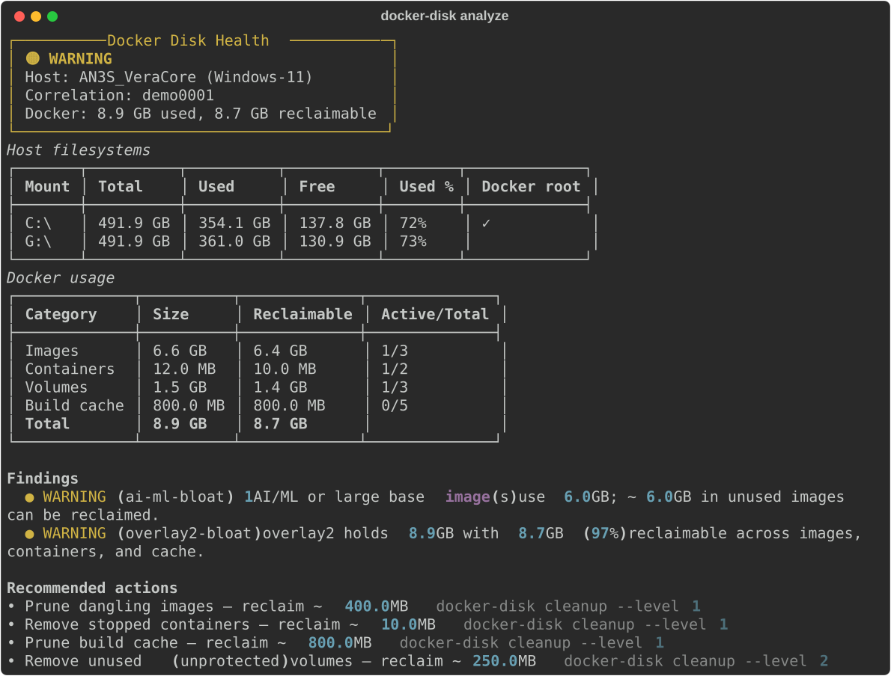
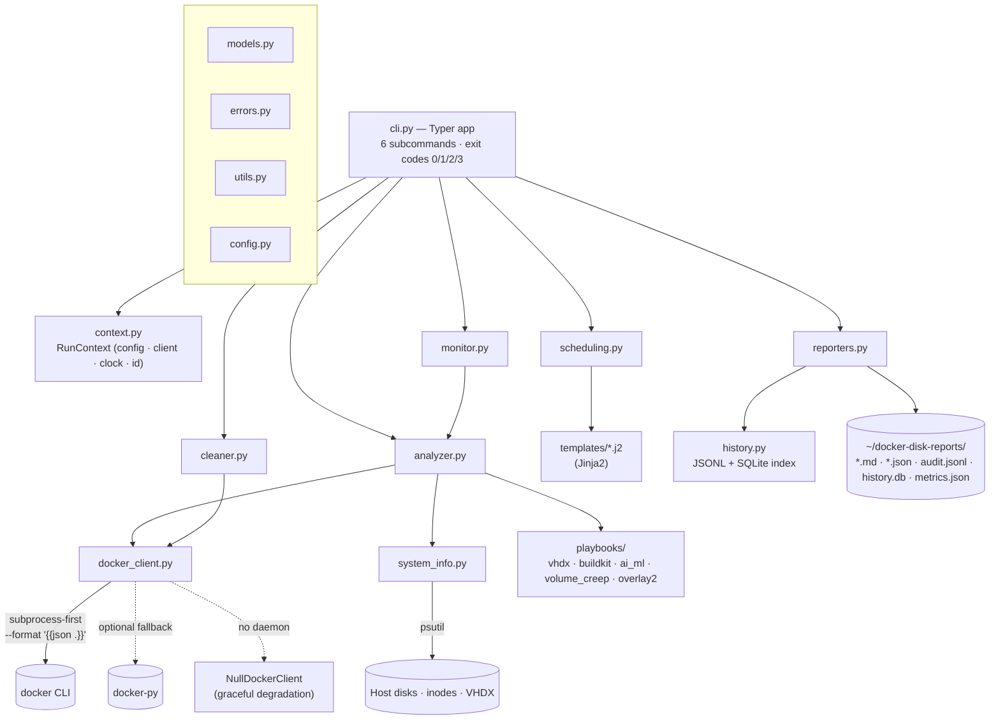
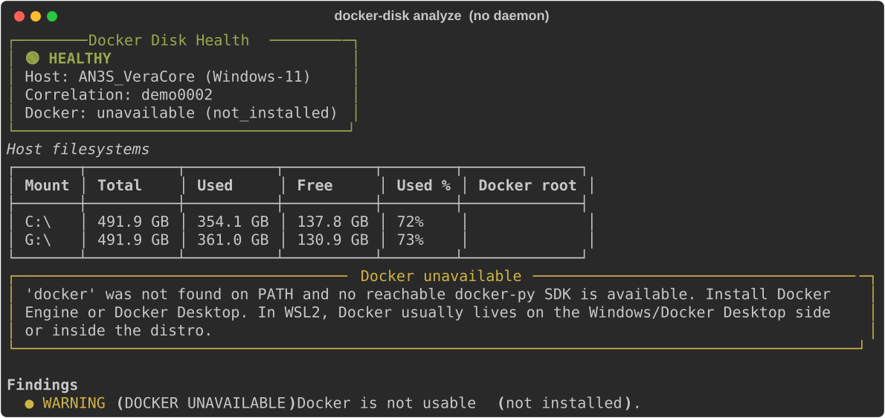
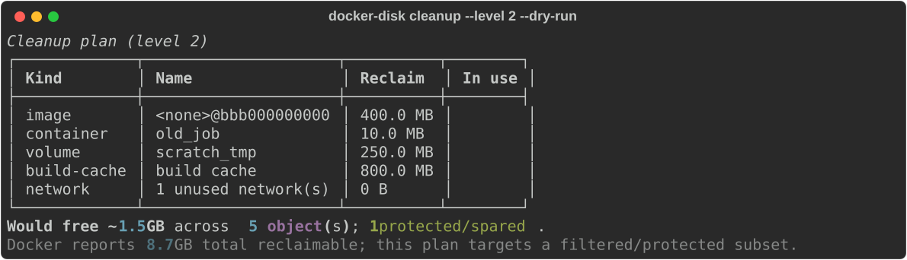
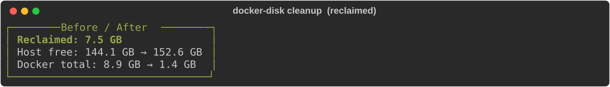
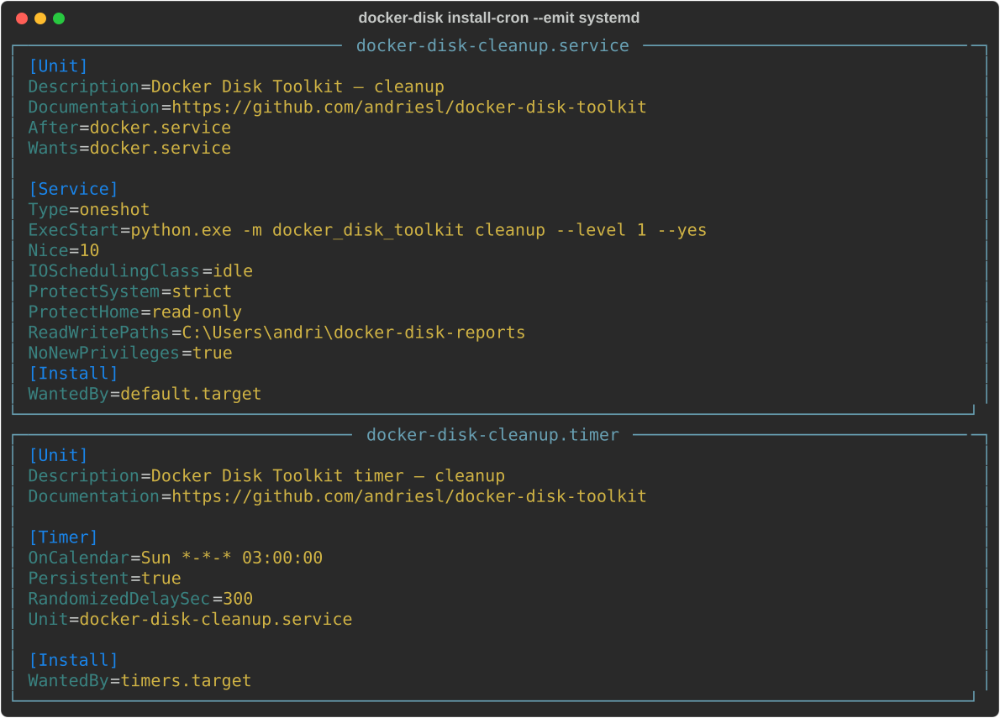

<div align="center">

# 🐳🧹 Docker Space Analyzer &amp; Reclaimer CLI

**Diagnose why Docker ate your disk, reclaim the space safely, and stop it happening again — with a full audit trail.**

[](pyproject.toml)
[](https://typer.tiangolo.com)
[](https://rich.readthedocs.io)
[](https://docs.pydantic.dev)
[](tests/)
[](pyproject.toml)
[](pyproject.toml)
[-yellow)](#license)



</div>

---

## Overview

**Docker Space Analyzer &amp; Reclaimer CLI** (`docker-disk`, alias `ddt`) is a cross-platform command-line toolkit that turns the recurring *"we ran out of disk with Docker again"* firefight into a repeatable, safe, observable loop:

> **diagnose → free space safely → prevent recurrence → leave an audit trail**

It works with **Docker Engine and Docker Desktop** across Linux, WSL2, macOS, and Windows, in both root and rootless modes, and — critically — degrades gracefully when no daemon is reachable instead of crashing.

**Primary personas (evidenced by the built-in default protect-lists in [`config.py`](src/docker_disk_toolkit/config.py) and the recovery playbooks in [`playbooks/`](src/docker_disk_toolkit/playbooks/)):**

- **Self-hosters &amp; home-labbers** running databases, Nextcloud, Grafana/Prometheus, TrueNAS-adjacent volumes.
- **AI/ML practitioners** whose Ollama models and CUDA/PyTorch images silently consume tens of GB.
- **Windows/WSL2 developers** whose Docker Desktop `ext4.vhdx` grows but never shrinks and fills `C:`.
- **DevOps engineers** who want a safe, audited, schedulable prune instead of a risky `docker system prune -af --volumes`.

The core value proposition: **you can act on disk pressure without fear.** Every destructive action is dry-run by default, protects your stateful volumes by default, requires explicit confirmation, and is recorded to an append-only audit log.

## Architecture



The **`docker_client.py`** abstraction is the keystone: it talks to Docker through the `docker` CLI via an *injected command runner*, requesting machine-readable JSON, and selects one of three backends (`CliDockerClient`, optional `ApiDockerClient` via docker-py, or `NullDockerClient`) through a factory that **never raises**. `analyzer.py` assembles a correlated snapshot (which images/volumes are actually in use), runs the recovery-playbook detectors, and grades health; `cleaner.py` builds a reviewable prune plan and executes it item-by-item; `reporters.py`/`history.py` persist timestamped reports, an append-only audit log, and a rebuildable SQLite trend index.

## Tech Stack

| Category | Technology (as pinned in [`pyproject.toml`](pyproject.toml)) |
| --- | --- |
| **Language** | Python `>=3.12` (developed/tested on 3.13) |
| **CLI framework** | `typer >= 0.12` |
| **Terminal UI** | `rich >= 13.7` (tables, panels, colour-coded health) |
| **Config &amp; validation** | `pydantic >= 2.6`, `pydantic-settings >= 2.2` |
| **Structured logging** | `structlog >= 24.1` (per-run correlation id) |
| **Host metrics** | `psutil >= 5.9` (disk, inodes, partitions) |
| **Templating** | `jinja2 >= 3.1` (systemd/cron/Task Scheduler/report artifacts) |
| **Paths** | `platformdirs >= 4.2` |
| **Config files** | `pyyaml >= 6.0` |
| **Docker access** | `docker` CLI via `subprocess` (primary); `docker >= 7.0` SDK (optional `[sdk]` extra) |
| **History store** | `sqlite3` (stdlib) indexing append-only JSONL |
| **Tooling** | `pytest`, `pytest-cov`, `mypy` (strict), `ruff`, `black`; `hatchling` build backend |
| **Packaging** | `uv tool install .` / `pipx install .`; console scripts `docker-disk`, `ddt` |

_~6,300 lines of application code across 23 modules; 263 passing tests (~90% coverage); mypy-strict clean._

## Key Features

- **🔍 Deep diagnostics (`analyze`)** — host `df` + inode usage, `docker system df`, top space consumers, dangling/unused objects, and **in-use correlation** (does anything actually reference this image/volume?), with a colour-coded health verdict. *Benefit: know exactly what is safe to remove before touching anything.*
- **🧹 Safety-first cleanup (`cleanup`)** — four explicit levels (0 report → 1 safe → 2 aggressive-protected → 3 nuclear). Dry-run is the default; a **protect-list guards databases/Nextcloud/TrueNAS volumes by default**; non-interactive shells refuse without `--yes`; nuclear needs `--force` *and* a typed confirmation. *Benefit: reclaim space without ever nuking a database.*
- **🚑 Emergency mode (`emergency`)** — runs the safest high-impact prune first, then prints higher-impact next steps (including the guarded `docker system prune -af --volumes` one-liner it will not run for you). *Benefit: free space now, safely, when the disk is already full.*
- **🖥️ Docker Desktop / WSL2 aware** — detects that host free space ≠ Docker's space when data lives in an `ext4.vhdx`, locates the VHDX files, and generates a compaction playbook (`wsl --shutdown` + `Optimize-VHD`/`diskpart`). *Benefit: fixes the #1 "Docker ate my C:" cause on Windows.*
- **🧠 Recovery playbooks** — situation detectors that emit copy-paste scripts for VHDX bloat, BuildKit cache explosion, AI/ML image bloat (Ollama/CUDA), named-volume creep, and overlay2 bloat. *Benefit: a tailored fix, not a generic one.*
- **🔮 Forensics (`analyze --forensic`)** — "what just ate my disk?" correlates recently created images/build-cache/containers with the growth. *Benefit: root-cause a sudden spike.*
- **📈 Monitoring &amp; automation** — `monitor` watchdog writes `metrics.json` (+ optional Prometheus textfile) and notifies on breach; `install-cron` generates **systemd timer/service, crontab, and Windows Task Scheduler XML**. *Benefit: prevent recurrence, feed your existing observability.*
- **🧾 Reporting &amp; audit** — every run writes timestamped Markdown + JSON reports; every deletion is appended to `audit.jsonl`; trends land in a rebuildable SQLite index (`report --last 30d`). *Benefit: a defensible record of what was freed, when, by which command.*
- **🛟 Graceful degradation** — no daemon? `analyze` still reports host disks and exits cleanly with actionable remediation. *Benefit: never a stack trace in your face.*

## Interface Walkthrough &amp; Screenshots

This is a **CLI application with a Rich-rendered terminal UI** — there is no web frontend. The captures below are real SVG exports of the application's own render functions (reproduce them anytime with [`scripts/capture_screenshots.py`](scripts/capture_screenshots.py)). The observed aesthetic is a **Rich "boxed" terminal design system**: rounded Unicode panels, right-aligned size columns, and a consistent severity colour language — 🟢 green = healthy, 🟡 yellow = warning, 🔴 red = critical — applied uniformly across health banners, thresholds, and findings.

### 1. Diagnostic dashboard — `docker-disk analyze`


The landing view. A bordered **health panel** (host, correlation id, Docker totals) sits above a **Host filesystems** table (per-mount total/used/free with the ≥80%/≥90% usage cells colour-shifted to yellow/red) and a **Docker usage** table (per-category size, reclaimable, active/total, with a bold Total row). Below, **Findings** and **Recommended actions** translate the raw numbers into next steps — here the AI/ML bloat detector has flagged a large Ollama image. The right-aligned humanised sizes and the single-glance colour verdict make it immediately scannable.

### 2. Graceful degradation — no daemon reachable



Captured against this host's real state (Docker Desktop installed but not running). Instead of a traceback, the tool reports host disks normally, renders a **yellow "Docker unavailable" panel** with concrete remediation, and adds a `DOCKER_UNAVAILABLE` finding — exiting `0` because the host itself is healthy. This is the behaviour that makes the tool safe to drop into any environment or cron job.

### 3. Safe cleanup plan — `docker-disk cleanup --level 2 --dry-run`



Before anything is removed, the **plan table** lists every candidate (kind, name, reclaim size, in-use flag). The summary line shows the space this run would free **and** how many objects were protected/spared — at level 2 the `postgres_data` volume is held back by the default protect-list. Docker's own reported reclaimable total is shown alongside the filtered subset, so the difference between "everything unused" and "what this safe run targets" is explicit.

### 4. Before / after reclaim — `docker-disk cleanup`



After a real run, a **green delta banner** reports exactly how much was reclaimed, with host-free and Docker-total before/after values — the proof-of-work that closes the loop and feeds the historical trend index.

### 5. Preventive automation — `docker-disk install-cron --emit systemd`



`install-cron` renders ready-to-install artifacts — here the hardened **systemd service + timer** (idle IO scheduling, `Persistent=true`, weekly `OnCalendar`). It prints the exact install command and never performs a privileged install itself. `--emit all` additionally produces a crontab line and a Windows Task Scheduler XML.

## Walkthrough Video

> 🎬 **Demo video — coming soon.**
> A short screencast of the full `analyze → cleanup → install-cron` loop will live here. Recommended approach: record the terminal with [`asciinema`](https://asciinema.org) (`asciinema rec docs/demo.cast`) and embed the player badge, or upload an MP4/GIF to `assets/` and reference it. Until then, the SVG captures above and the copy-paste examples in [Getting Started](#getting-started) demonstrate every screen.

## Technical Debt &amp; Risks

Honest, evidence-based assessment. Ordered by real-world impact; **no secrets are exposed by this tool** — `webhook_url` is stored as `SecretStr` ([`config.py`](src/docker_disk_toolkit/config.py)), is never logged (delivery failures record only the exception type), and `hide_input_in_errors` keeps it out of validation messages too.

| Priority | Category | Finding (evidence) | Suggested remediation |
| --- | --- | --- | --- |
| 🟠 Med | **Security / Compliance (POPIA/GDPR)** | Reports and the audit log under `~/docker-disk-reports/` persist Docker object names (image tags, container &amp; volume names) and host paths as **plaintext** JSON/JSONL/SQLite — see `flatten_report` / `append_audit` in [`reporters.py`](src/docker_disk_toolkit/reporters.py) and `AuditEvent` in [`models.py`](src/docker_disk_toolkit/models.py). Volume/container names can embed customer or personal identifiers. **Partly mitigated:** the report directory is now created `0700` (owner-only) via `ensure_private_dir`. Still outstanding: no retention limit, redaction, or encryption. | Document a retention policy, add an opt-in name-redaction mode, and note data-handling in a `SECURITY.md`. |
| ✅ Fixed | **Licensing / Maintainability** | `pyproject.toml` declares MIT; a top-level [`LICENSE`](LICENSE) file now exists and ships in the sdist. | — |
| 🟠 Med | **Testing** | The docker-py SDK fallback `ApiDockerClient` ([`docker_client.py:827`](src/docker_disk_toolkit/docker_client.py)) is marked `# pragma: no cover — requires docker-py + a live daemon`; the real-daemon path is unverified by the suite. | Add an opt-in integration test guarded by a "Docker available" marker in CI. |
| 🟠 Med | **Observability / CI** | No `.github/workflows` exists — the quality gates (`ruff`, `black`, `mypy --strict`, `pytest`) run only locally via the [`Makefile`](Makefile); PRs are not automatically checked. | Add a CI workflow running `make all` on Python 3.12–3.14. |
| 🟡 Low | **Platform coverage** | The POSIX inode branch in `get_inode_usage` ([`system_info.py`](src/docker_disk_toolkit/system_info.py)) is unreachable on the Windows dev host and is validated only via a mocked `os.statvfs`; real inode reporting is not exercised end-to-end on Linux in CI. | Cover with a Linux CI job (folds into the item above). |
| 🟡 Low | **Operational (mirror sync)** | The project is mirrored to three GitHub remotes that must be kept identical (see [`AGENTS.md`](AGENTS.md)); because two mirrors started from unrelated histories, keeping them in sync currently relies on force-push and human discipline. | Configure the documented `all` push-remote or a pre-push hook to fan out automatically. |

## Impact on Organizations &amp; Users

- **Turns firefights into a process.** Instead of an ad-hoc, high-adrenaline `docker system prune` at 2 a.m., teams get a repeatable *diagnose → free → prevent → audit* loop with a defensible record of every deletion.
- **Protects revenue-critical data by default.** The built-in protect-list means an aggressive cleanup will not silently delete a Postgres, MySQL, Nextcloud, or TrueNAS volume — the single most expensive mistake in this class of tooling.
- **Reclaims real capacity on the most common offender.** For Windows/WSL2 shops, the VHDX-aware diagnostics and compaction playbook recover disk that a normal prune cannot touch, often tens of GB per workstation.
- **Feeds existing observability cheaply.** A single JSON metrics file and an optional Prometheus textfile drop straight into node_exporter/Grafana, so disk pressure becomes a dashboard signal rather than a surprise outage.
- **Lowers the barrier for non-experts.** Colour-coded health, plain-language findings, and generated recovery scripts let a junior engineer safely act on disk pressure without deep Docker-internals knowledge.

## Getting Started

### Prerequisites

- **Python 3.12+**
- Optional: a reachable **Docker Engine or Docker Desktop** (the tool runs and reports host disks without one)
- Recommended installer: [`uv`](https://docs.astral.sh/uv/) or [`pipx`](https://pipx.pypa.io/)

### Install

```bash
# From a checkout (choose one)
uv tool install .
pipx install .

# …or run from source for development
uv venv --python 3.13
uv pip install -e ".[dev]"
```

This installs the `docker-disk` (and `ddt`) console scripts.

### First run

```bash
# Instant diagnosis (host + Docker disk usage, findings, recommendations)
docker-disk analyze

# Machine-readable output for automation
docker-disk analyze --json | jq

# Preview a safe cleanup — nothing is removed
docker-disk cleanup --dry-run --level 1

# Aggressive but protected cleanup (databases/Nextcloud/TrueNAS spared)
docker-disk cleanup --level 2 --protect 'postgres|nextcloud|truenas' --yes --no-dry-run

# Free space NOW, safest high-impact first, then guidance
docker-disk emergency --no-dry-run

# "What just ate my disk?"
docker-disk analyze --forensic --since 24h

# Generate a weekly safe-prune schedule for your platform
docker-disk install-cron --action cleanup --level 1 --schedule weekly --emit all
```

### Configuration

Settings resolve with precedence **CLI flag &gt; env `DOCKER_DISK_*` &gt; YAML &gt; defaults**. The YAML file is looked up at `--config PATH`, `$DOCKER_DISK_CONFIG`, `~/.config/docker-disk-toolkit/config.yaml`, then the platform config dir.

```yaml
# ~/.config/docker-disk-toolkit/config.yaml
thresholds:
  critical_free_gb: 5      # must satisfy: critical <= min <= warn
  min_free_gb: 10
  warn_free_gb: 20
  max_docker_percent: 70   # Docker usage as % of its host disk
protect_volumes_regex: ["^backup_"]
use_default_protect: true  # built-in DB/Nextcloud/TrueNAS guards
report_dir: ~/docker-disk-reports
dry_run: true              # safe default
```

Environment example: `DOCKER_DISK_THRESHOLDS__MIN_FREE_GB=15`. No `.env` or secret files are required to run.

### Development &amp; troubleshooting

```bash
make test        # pytest
make cov         # pytest with the >=80% coverage gate
make lint        # ruff + black --check
make typecheck   # mypy --strict
make all         # lint + typecheck + cov
```

- **Exit codes:** `0` healthy · `1` warning (issues found / low space but cleaned) · `2` critical · `3` fatal.
- **"docker: command not found"** on Windows/WSL2 — Docker often lives on the Docker Desktop side or inside the distro; `analyze` will still report host disks. Set `docker.cli_path` in config if the binary is elsewhere.
- **No daemon for `cleanup`/`emergency`** — these require Docker and exit `3` with remediation; `analyze` does not.
- **No Python on the host?** Use the standalone [`scripts/emergency-cleanup.sh`](scripts/emergency-cleanup.sh) (needs only the `docker` CLI).

See [`docs/RECOVERY_PLAYBOOKS.md`](docs/RECOVERY_PLAYBOOKS.md) for the full recovery recipes.

## Contributing

Contributions are welcome. This repository is **mirrored across three GitHub remotes that must be kept identical** — read [`AGENTS.md`](AGENTS.md) before pushing.

- **Quality gates:** run `make all` (ruff + black + mypy-strict + pytest ≥80% coverage) before every PR — never push code that fails them.
- **Code style:** PEP 8 via Ruff/Black (line length 100), full type hints, Google-style docstrings. Match the surrounding module's conventions.
- **UI/UX changes:** any change to terminal output **must include refreshed screenshots** — run `.venv/Scripts/python.exe scripts/capture_screenshots.py` and commit the updated SVGs under `assets/screenshots/`.
- **Tests:** the suite runs entirely against recorded Docker fixtures (`tests/docker_fixtures.py`) — **no daemon required**. Add a fixture scenario for new Docker-facing behaviour and a unit test for new logic.
- **Bug reports:** include OS, Docker flavor (Engine/Desktop/rootless), the failing command, and the `--json` output where possible.
- **Commits:** conventional-commit style (`feat:`, `fix:`, `docs:`) as used in the existing history.

## License

This project declares the **MIT License** in [`pyproject.toml`](pyproject.toml) (`license = { text = "MIT" }`), but **no `LICENSE` file is currently present** in the repository. Until one is added, redistribution terms are ambiguous — adding a standard top-level `LICENSE` (MIT) file is recommended and tracked in [Technical Debt &amp; Risks](#technical-debt--risks).
